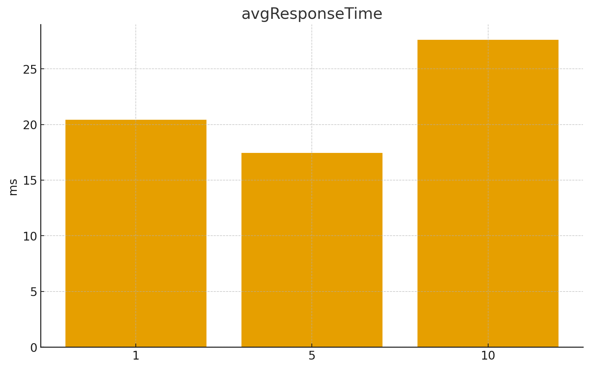
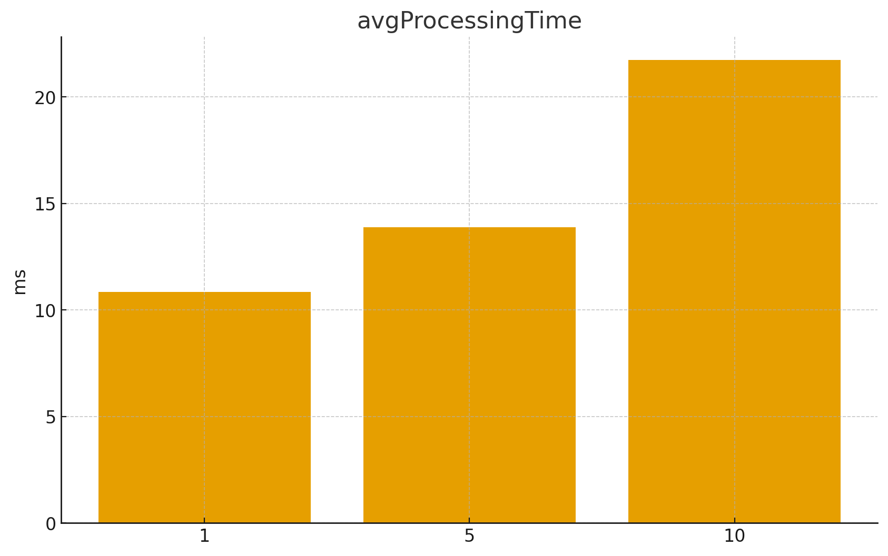
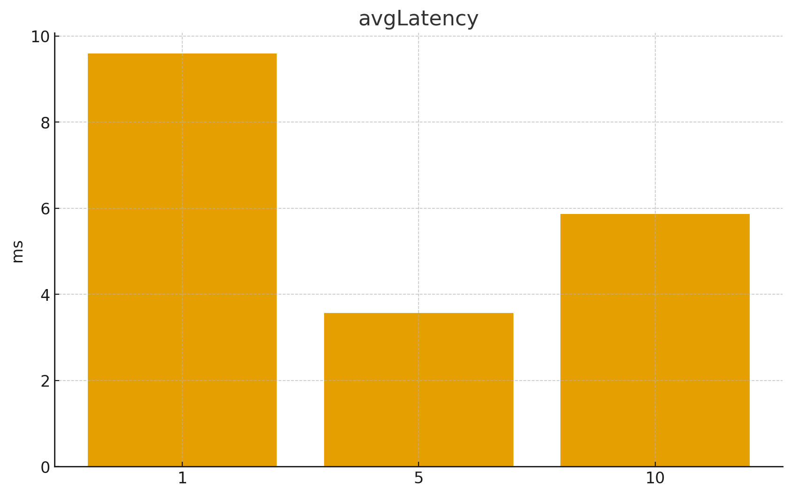

# 🚀 AV3 --- Sistema de Gestão

Projeto **AV3**, uma aplicação full-stack que integra:

-   Frontend em **React**
-   Backend em **Node.js + Express + prisma + typescript**

------------------------------------------------------------------------

## 📦 Pré-requisitos

Antes de rodar o projeto, instale:

-   **Node.js**

------------------------------------------------------------------------

## ▶️ Como rodar o projeto

### 🧱 Primeira vez rodando o projeto

Use o comando abaixo na **pasta raiz**:

``` sh
npm run dev
```

Esse comando executa automaticamente:

-   Instalação das dependências (`npm install`)
-   Geração do banco de dados via Prisma (`prisma migrate`)
-   Compilação dos arquivos TypeScript (`tsc`)
-   Execução do backend + frontend

------------------------------------------------------------------------

### 🔄 Executando novamente (modo rápido)

Se você **já rodou o projeto antes** e só fez pequenas alterações:

``` sh
npm run test
```

------------------------------------------------------------------------


## 📊 Métricas de Performance

### ⏱️ Tempo de Resposta (ms)


### ⚙️ Tempo de Processamento (ms)


### 📡 Latência (ms)


------------------------------------------------------------------------

## 👨‍💻 Autor

# Sette0_0

Projeto **AV3** --- desenvolvido para fins acadêmicos.
